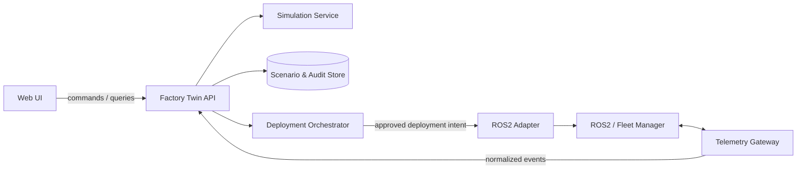

# Integration Boundaries

Tài liệu này mô tả hợp đồng khái niệm, không đóng đinh REST, WebSocket, DDS hay message broker. Khi triển khai, mỗi lớp có thể thay đổi công nghệ miễn là giữ nguyên ý nghĩa của command/event.

## Ranh giới hệ thống



## UI không được biết

- ROS2 topic/service names.
- Gazebo world-file paths.
- Robot vendor protocol.
- Database table names.
- Cách simulation job được phân phối.

UI chỉ biết các ID ổn định như `siteId`, `zoneId`, `scenarioId`, `runId`, `reviewId` và `deploymentId`.

## Command từ UI

| Command | Ý nghĩa | Kết quả mong đợi |
|---|---|---|
| `CreateScenario` | Tạo draft từ snapshot hiện tại | Scenario ID/version |
| `RunSimulation` | Chạy candidate trong môi trường số | Run ID để theo dõi |
| `SubmitReview` | Khóa version và gửi bằng chứng | Review ID |
| `DecideReview` | Approve/reject bởi con người | Quyết định có audit metadata |
| `QueueDeployment` | Tạo ý định triển khai đã được duyệt | Deployment ID, chưa phải lệnh ROS2 |
| `AcknowledgeAlert` | Ghi nhận người dùng đã xem cảnh báo | Alert audit entry |

## Event về UI

| Event | Dữ liệu tối thiểu |
|---|---|
| `TelemetryUpdated` | robot ID, pose, battery, state, timestamp |
| `KpiUpdated` | throughput, cycle time, congestion, window |
| `AlertRaised` | severity, robot/zone, location, evidence |
| `SimulationProgressed` | run ID, phase, progress, logs summary |
| `SimulationCompleted` | metrics, guardrails, risk report ID |
| `ReviewDecided` | review ID, decision, reviewer, timestamp |
| `DeploymentStatusChanged` | deployment ID, phase, reason, timestamp |

## Approval invariant

Backend phải từ chối `QueueDeployment` nếu thiếu bất kỳ điều kiện nào:

1. Scenario version đã bị thay đổi sau simulation.
2. Simulation run không thành công hoặc quá hạn.
3. Risk report có critical finding chưa được xử lý.
4. Review không ở trạng thái `Approved`.
5. Người gọi không có quyền deployment.
6. Site/zone hiện tại không khớp với phạm vi đã phê duyệt.

## Cấu trúc thư mục triển khai đề xuất trong tương lai

```text
apps/
  web/                         # React/Next.js + Three.js
services/
  factory_twin_api/            # FastAPI/BFF và domain workflow
  simulation_worker/           # Gazebo/digital twin jobs
integrations/
  ros2_adapter/                # ROS2-specific nodes/topics/services
packages/
  contracts/                   # OpenAPI/AsyncAPI/JSON Schema sinh dùng chung
design/
  factory-twin/                # UI flow và wireframe hiện tại
```

Chỉ tạo các thư mục runtime trên khi nhóm bắt đầu triển khai thành phần tương ứng; không cần di chuyển backend scaffold hiện tại trong giai đoạn wireframe.
