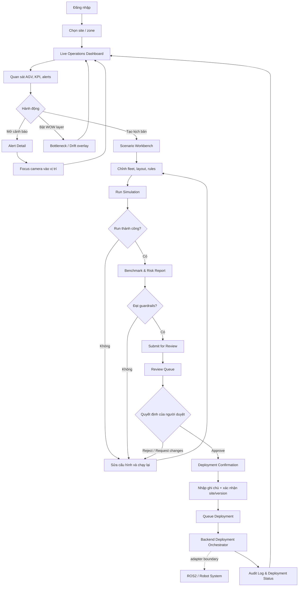
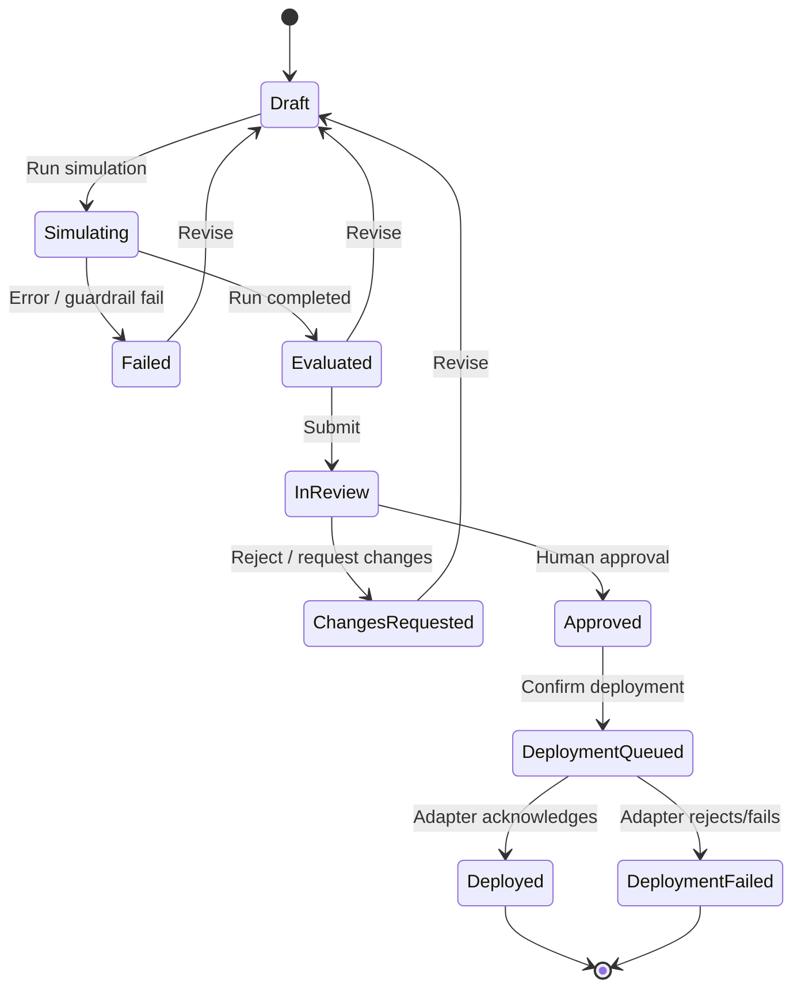
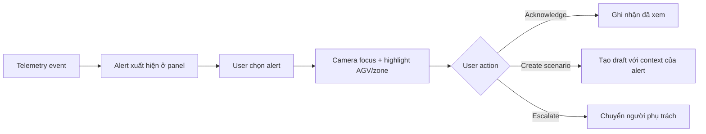

# Factory Twin — UI Flow

## Vai trò

- **Fleet Operator:** giám sát robot, cảnh báo và KPI.
- **Simulation Engineer:** tạo/chạy kịch bản và gửi duyệt.
- **Reviewer:** xem bằng chứng, phê duyệt hoặc từ chối.
- **Deployment Operator:** xác nhận cửa sổ triển khai và theo dõi kết quả.

Một người có thể mang nhiều vai trò ở bản demo, nhưng quyền vẫn được thể hiện tách biệt trên UI.

## Luồng tổng thể

## State machine của kịch bản

## Quy tắc chuyển trạng thái

| Từ | Hành động | Điều kiện bắt buộc | Sang |
|---|---|---|---|
| Draft | Run simulation | Cấu hình hợp lệ | Simulating |
| Evaluated | Submit | Có run ID, baseline, KPI và risk report | InReview |
| InReview | Approve | Có quyền reviewer và ghi chú | Approved |
| Approved | Queue deployment | Xác nhận site, scenario version và deployment window | DeploymentQueued |
| DeploymentQueued | Execute | Backend kiểm tra approval token còn hiệu lực | Deployed/DeploymentFailed |

## Luồng cảnh báo

