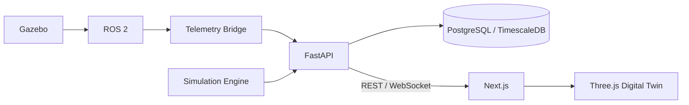

# System Architecture

## High-level Architecture

## Runtime Boundaries
- Edge
- ROS 2
- Gazebo
- Nav2
- Fleet Manager
- Telemetry Bridge
- Application / Cloud
- FastAPI
- PostgreSQL / TimescaleDB
- Simulation Engine
- Next.js
- Three.js

Đây mới là bản architecture **v0**. Sau này mỗi quyết định lớn cập nhật ADR.