# EV Factory Digital Twin — MVP Advanced Architecture

> **Project:** EV Factory Digital Twin for AMR-based Battery Intralogistics  
> **Scope:** Core Platform Architecture  
> **Status:** Architecture Baseline  
> **Version:** 0.1

---

# 1. Purpose

EV Factory Digital Twin là nền tảng mô phỏng, giám sát và đánh giá hoạt động vận chuyển battery pack bằng AMR trong khu vực Final Assembly của nhà máy xe điện.

Core platform phải hỗ trợ hai thế giới sử dụng cùng một mô hình Digital Twin:

```text
PLANNING / SIMULATION
        +
LIVE / OPERATIONS
```

Mục tiêu chính:

```text
CREATE
  ↓
SIMULATE
  ↓
MEASURE
  ↓
COMPARE
  ↓
APPROVE
  ↓
MONITOR
```

Core phải là nền móng ổn định để các chức năng nâng cao có thể được tích hợp sau này mà không cần viết lại hệ thống.

---

# 2. Core Problem

Battery pack cần được vận chuyển từ Battery Buffer tới Battery Marriage Station đúng thời điểm để phục vụ dây chuyền Final Assembly.

Luồng cơ bản:

```text
Battery Buffer
      │
      │ pickup
      ▼
     AMR
      │
      │ transport
      ▼
Marriage Station
      │
      ▼
   Vehicle
```

Các vấn đề cần Digital Twin hỗ trợ:

- Battery tới Marriage Station trễ.
- Line starvation.
- AMR congestion.
- AMR waiting.
- Fleet size không tối ưu.
- Charging gây thiếu robot phục vụ production.
- Layout gây bottleneck.
- Không biết robot/battery/task đang ở trạng thái nào.
- Khó đánh giá layout mới trước khi áp dụng.
- Khó so sánh nhiều phương án vận hành.
- Khó replay và phân tích incident.

---

# 3. Core Functional Scope

Core platform bắt buộc có các capability sau.

## 3.1 Realtime Digital Twin

- Hiển thị factory.
- Hiển thị AMR realtime.
- Position.
- Orientation.
- Velocity.
- Battery.
- Robot state.
- Current task.
- Payload.
- Destination.
- Connection status.

---

## 3.2 ROS 2 / Gazebo Integration

- AMR model.
- Gazebo simulation.
- ROS 2 topics.
- Odometry.
- Navigation.
- Robot telemetry.
- Telemetry bridge.

---

## 3.3 AMR Fleet Management

- Robot registry.
- Robot state tracking.
- Task assignment.
- Robot availability.
- Battery awareness.
- Charging state.
- Task execution lifecycle.

---

## 3.4 Battery Logistics

- Battery Buffer.
- Battery Pack.
- Marriage Station.
- Pickup.
- Transport.
- Delivery.
- Battery location tracking.

---

## 3.5 Factory KPI

Core KPI:

- Throughput.
- Cycle Time.
- Line Starvation.
- AMR Utilization.
- AMR Waiting.
- Congestion.
- Travel Distance.
- Delivery Delay.
- Battery / charging state.

---

## 3.6 Discrete Event Simulation

Cho phép chạy what-if simulation với:

- Robot count.
- Robot speed.
- Charger count.
- Takt time.
- Task demand.
- Travel distance.
- Layout/configuration.

---

## 3.7 Scenario Management

- Create scenario.
- Clone scenario.
- Edit configuration.
- Run simulation.
- Store results.
- Compare scenarios.

---

## 3.8 Scenario Comparison

So sánh:

```text
BASELINE
vs
PROPOSED
```

theo các KPI chính.

---

## 3.9 Congestion Analysis

- Zone occupancy.
- Robot waiting.
- Congestion event.
- Route visualization.
- Heatmap.

---

## 3.10 Layout / Configuration Management

MVP hỗ trợ:

- Stations.
- Racks.
- Chargers.
- Paths.
- Traffic zones.
- No-go zones.

---

## 3.11 Historical Telemetry & Replay

- Store telemetry.
- Query history.
- Playback.
- Timeline.
- Incident replay.

---

## 3.12 Human Approval

Workflow:

```text
DRAFT
  ↓
SIMULATED
  ↓
SUBMITTED
  ↓
APPROVED / REJECTED
```

---

# 4. Non-Goals of Core

Các chức năng sau **không thuộc Core Architecture v0.1**:

- Battery genealogy.
- Quality containment.
- Battery Passport.
- Shadow Factory.
- Factory Multiverse.
- Factory Autopilot.
- Supply-chain integration.
- Precision recall.
- Field vehicle telemetry.
- AI chatbot.
- Predictive maintenance.
- Computer vision.
- Reinforcement learning.
- MES/ERP integration.

Core chỉ phải đảm bảo kiến trúc đủ sạch để sau này tích hợp các module trên.

---

# 5. Technology Stack

## Backend

```text
Python 3.12
uv
FastAPI
Pydantic
SQLAlchemy
asyncpg
```

## Database

```text
PostgreSQL 17 via Supabase
```

## Simulation

```text
SimPy
NumPy
Pandas
```

## Robotics

```text
ROS 2 Jazzy
Gazebo Harmonic
Nav2
URDF / Xacro
rclpy
rosdep
colcon
```

## Frontend

```text
Next.js
TypeScript
React
Tailwind CSS
shadcn/ui
Zustand
Zod
Three.js
React Three Fiber
ECharts
```

## DevOps

```text
Git
GitHub
GitHub Actions
Docker (when a component has a real image)
GitHub Actions
```

---

# 6. High-Level Architecture

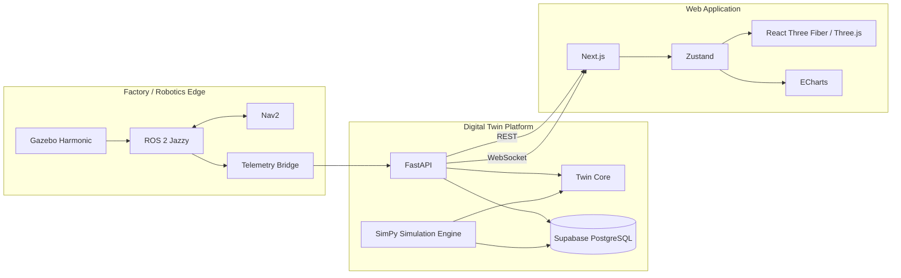

---

# 7. Fundamental Architectural Principle

Browser không giao tiếp trực tiếp với ROS.

Không dùng:

```text
Browser
   ↓
ROS DDS
```

Bắt buộc:

```text
ROS
 ↓
Telemetry Bridge
 ↓
FastAPI
 ↓
WebSocket
 ↓
Browser
```

Lý do:

- Tách robotics khỏi application layer.
- Browser không phụ thuộc DDS.
- Dễ deploy frontend/backend trên cloud.
- Dễ mock ROS.
- Dễ replay.
- Dễ test.
- Dễ thay nguồn telemetry.

---

# 8. Runtime Modes

Platform will normalize three telemetry sources. MOCK is implemented; ROS and
REPLAY are planned CORE sources.

```text
MOCK
ROS
REPLAY
```

Kiến trúc:

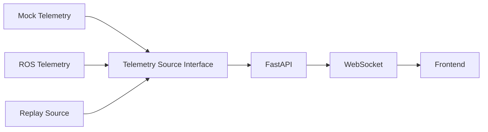

Backend và frontend không được phụ thuộc trực tiếp vào loại source.

---

# 9. Repository Architecture

```text
P-078/
│
├── apps/
│   ├── backend/
│   │   ├── src/ev_twin_api/
│   │   ├── tests/
│   │   └── pyproject.toml
│   │
│   └── frontend/
│       ├── src/
│       ├── public/
│       └── package.json
│
├── packages/
│   └── twin-core/
│       ├── src/twin_core/
│       ├── tests/
│       └── pyproject.toml
│
├── services/
│   └── simulation/
│       ├── src/ev_sim/
│       ├── scenarios/
│       ├── tests/
│       └── pyproject.toml
│
├── ros2_ws/
│   └── src/
│       ├── amr_description/
│       ├── amr_gazebo/
│       ├── amr_navigation/
│       ├── fleet_manager/
│       ├── task_manager/
│       └── telemetry_bridge/
│
├── evaluation/
│
├── assets/
│
├── docs/
│
├── infra/
│
├── scripts/
│
├── tests/
│   └── integration/
│
├── pyproject.toml
├── uv.lock
├── Makefile
└── README.md
```

---

# 10. Layer Responsibilities

## 10.1 Twin Core

`packages/twin-core`

Twin Core chứa domain model và logic dùng chung.

Không phụ thuộc:

- FastAPI.
- ROS.
- Next.js.
- Database implementation.

Đây là phần trung tâm của application.

```text
twin_core/
├── domain/
│   ├── robot.py
│   ├── battery.py
│   ├── task.py
│   ├── station.py
│   ├── layout.py
│   └── scenario.py
│
├── telemetry/
│   └── models.py
│
├── metrics/
│   ├── throughput.py
│   ├── cycle_time.py
│   ├── starvation.py
│   ├── utilization.py
│   └── congestion.py
│
└── events/
    └── models.py
```

Nguyên tắc:

```text
Backend
Simulation
Evaluation
        ↓
    Twin Core
```

Không implement cùng một business rule nhiều lần.

---

# 11. Core Domain Model

Các entity chính:

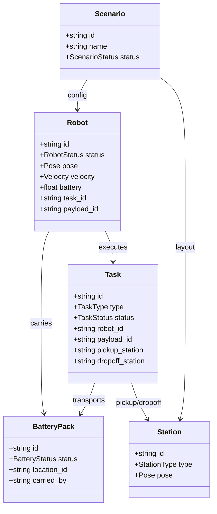

---

# 12. Robot Domain Model

Robot:

```text
Robot
├── id
├── pose
├── velocity
├── battery
├── status
├── task_id
├── payload_id
└── last_updated
```

Robot state enum:

```text
IDLE
MOVING
PICKING
DELIVERING
WAITING
CHARGING
ERROR
OFFLINE
```

State transition cơ bản:

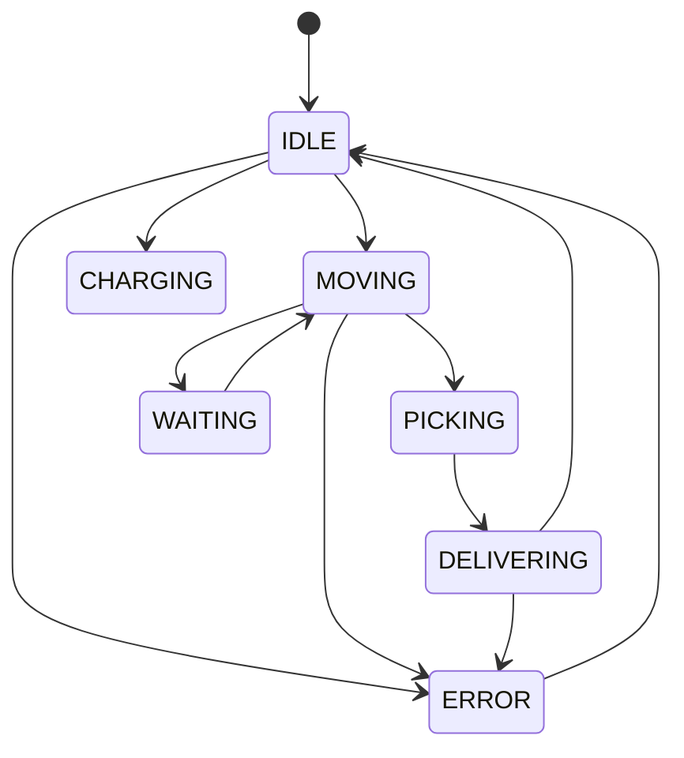

---

# 13. Battery Pack Domain Model

Battery:

```text
BatteryPack
├── id
├── status
├── location
├── carried_by
└── assigned_task
```

State:

```text
WAITING
ASSIGNED
IN_TRANSIT
DELIVERED
PROCESSING
COMPLETED
DELAYED
```

Transition:

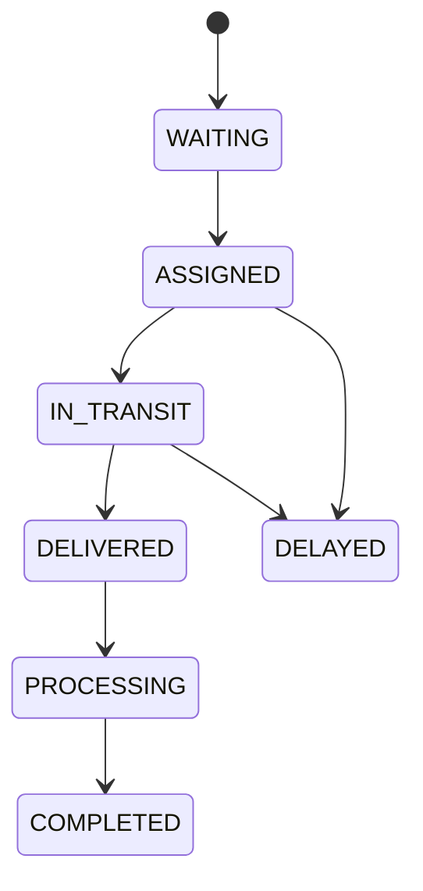

---

# 14. Task Domain Model

Task:

```text
Task
├── id
├── type
├── priority
├── status
├── payload_id
├── pickup_station
├── dropoff_station
├── robot_id
├── created_at
├── started_at
└── completed_at
```

MVP task type:

```text
DELIVER_BATTERY
GO_CHARGE
REPOSITION
```

Canonical MVP task state:

```text
QUEUED
ASSIGNED
PICKUP
DELIVERING
COMPLETED
FAILED
TIMED_OUT
```

Failed and timed-out attempts may return to `QUEUED` while their bounded retry
budget remains. Backend accepts legacy `IN_PROGRESS` and `DELIVERED` snapshots
for compatibility but does not emit them for new tasks.

---

# 15. Station Model

Station type:

```text
BATTERY_BUFFER
MARRIAGE_STATION
CHARGING_STATION
PARTS_WAREHOUSE
INSPECTION_STATION
```

Station:

```text
Station
├── id
├── type
├── position
├── rotation
├── capacity
└── status
```

---

# 16. Factory Layout Model

Layout:

```text
Layout
├── id
├── name
├── version
├── objects[]
├── paths[]
└── zones[]
```

Object:

```json
{
  "id": "battery-buffer-01",
  "type": "BATTERY_BUFFER",
  "x": 12.0,
  "y": 5.0,
  "rotation": 90
}
```

Traffic zone:

```text
Zone
├── id
├── polygon
├── type
└── capacity
```

Zone type:

```text
NORMAL
ONE_WAY
NO_GO
INTERSECTION
CHARGING
```

---

# 17. Telemetry Contract

Telemetry contract là interface quan trọng nhất giữa:

```text
ROS
Mock
Replay
Backend
Frontend
Database
Evaluation
```

Schema chuẩn:

```json
{
  "timestamp": "2026-08-16T10:30:12.123Z",
  "robot_id": "R01",
  "pose": {
    "x": 12.42,
    "y": 7.84,
    "yaw": 1.57
  },
  "velocity": {
    "linear": 1.10,
    "angular": 0.00
  },
  "battery": 72.4,
  "status": "DELIVERING",
  "task_id": "TASK-0284",
  "payload_id": "BP-0284"
}
```

Rules:

- Coordinate unit: meter.
- Angle: radian.
- Velocity: m/s.
- Battery: percentage `0..100`.
- Timestamp: UTC ISO-8601.
- Robot ID stable.
- Missing optional value dùng `null`.

---

# 18. Coordinate System

ROS sử dụng:

```text
X
Y
Z
```

Three.js:

```text
X
Y
Z
```

Phải thống nhất conversion duy nhất.

Ví dụ:

```text
ROS X → Three X
ROS Y → Three Z
ROS Z → Three Y
```

Frontend phải có một utility duy nhất:

```text
rosPoseToThreePose()
```

Không để từng component tự convert.

---

# 19. Backend Architecture

```text
ev_twin_api/
│
├── main.py
│
├── api/
│   ├── health.py
│   ├── robots.py
│   ├── telemetry.py
│   ├── tasks.py
│   ├── scenarios.py
│   ├── simulations.py
│   └── approvals.py
│
├── schemas/
│   ├── robot.py
│   ├── telemetry.py
│   ├── task.py
│   ├── scenario.py
│   └── simulation.py
│
├── services/
│   ├── robot_service.py
│   ├── telemetry_service.py
│   ├── task_service.py
│   ├── scenario_service.py
│   ├── simulation_service.py
│   └── websocket_manager.py
│
├── repositories/
│   ├── robot_repository.py
│   ├── telemetry_repository.py
│   ├── task_repository.py
│   └── scenario_repository.py
│
├── db/
│   ├── session.py
│   └── models/
│
└── core/
    └── config.py
```

Dependency direction:

```text
API
 ↓
Service
 ↓
Domain / Repository
 ↓
Database
```

API route không chứa business logic lớn.

---

# 20. Backend API

Base path:

```text
/api/v1
```

## Health

```http
GET /health
```

Response:

```json
{
  "status": "ok"
}
```

---

## Robots

```http
GET /api/v1/robots
```

```http
GET /api/v1/robots/{robot_id}
```

---

## Telemetry

```http
POST /internal/v1/telemetry
```

```http
GET /api/v1/robots/{robot_id}/telemetry (planned history query)
```

---

## Tasks

```http
GET /api/v1/tasks
POST /api/v1/tasks
GET /api/v1/tasks/{task_id}
```

---

## Layouts

```http
GET /api/v1/layouts
POST /api/v1/layouts
GET /api/v1/layouts/{layout_id}
```

---

## Scenarios

```http
GET /api/v1/scenarios
POST /api/v1/scenarios
GET /api/v1/scenarios/{scenario_id}
```

---

## Simulations

```http
POST /api/v1/simulations
GET /api/v1/simulations/{run_id}
GET /api/v1/simulations/{run_id}/results
```

---

## Approval

```http
POST /api/v1/scenarios/{scenario_id}/submit
POST /api/v1/scenarios/{scenario_id}/approve
POST /api/v1/scenarios/{scenario_id}/reject
```

---

# 21. WebSocket Architecture

Endpoint:

```text
/ws/factory
```

WebSocket Manager chịu trách nhiệm:

```text
connect
disconnect
broadcast
heartbeat
```

Message envelope:

```json
{
  "type": "robot.telemetry",
  "data": {}
}
```

---

# 22. WebSocket Event Types

The current `/ws/factory` contract is intentionally small and matches the
backend/frontend schemas:

```text
auth.ok
robot.telemetry
task.updated
metrics.updated
alert.created
factory.reset
```

New event types require an update to `docs/api.md`, backend Pydantic schemas,
frontend Zod schemas, and contract tests in the same checkpoint.

Simulation progress events are planned and are not part of the current browser
contract.

---

# 23. Live Telemetry Flow

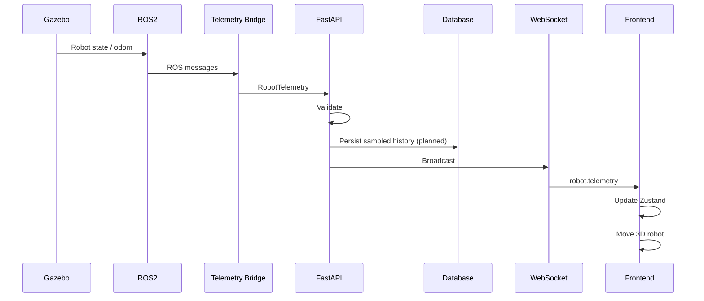

---

# 24. Mock Telemetry Flow

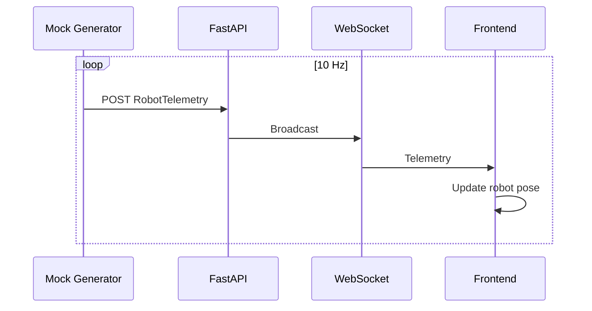

    Mục tiêu:

Frontend/backend development không phụ thuộc ROS.

---

# 25. ROS Architecture

ROS workspace:

```text
ros2_ws/src/
```

Core packages:

```text
amr_description
amr_gazebo
telemetry_bridge
```

Sau đó:

```text
amr_navigation
fleet_manager
task_manager
```

---

# 26. ROS Package Responsibilities

## amr_description

Chứa:

```text
URDF
Xacro
meshes
RViz config
```

---

## amr_gazebo

Chứa:

```text
Gazebo world
spawn launch
Gazebo plugins
simulation config
```

---

## amr_navigation

Chứa:

```text
Nav2 params
map
launch
navigation config
```

---

## fleet_manager

Chịu trách nhiệm:

```text
robot registry
task assignment
fleet state
```

---

## task_manager

Chịu trách nhiệm:

```text
task lifecycle
pickup/dropoff workflow
```

---

## telemetry_bridge

Chịu trách nhiệm:

```text
ROS messages
     ↓
normalize
     ↓
RobotTelemetry
     ↓
Backend
```

---

# 27. ROS Namespaces

Mỗi robot:

```text
/amr_01
/amr_02
...
```

Topics:

```text
/amr_01/odom
/amr_01/cmd_vel
/amr_01/battery_state
/amr_01/status
/amr_01/task
```

The Gazebo launch reads a validated fleet JSON and spawns at least two robots with
unique public IDs, ROS namespaces, entity names and poses. `/clock` is bridged once;
each robot independently bridges `cmd_vel`, `odom` and `tf` in its namespace.
Gazebo `OdometryPublisher` owns `odom -> base_footprint`; `robot_state_publisher`,
using simulation time, owns the static `base_footprint -> base_link` transform.
`VelocityControl` provides planar motion without wheel-contact physics. Dynamic
wheel transforms are intentionally deferred until Gazebo joint states are bridged.
The state simulator publishes battery/status/task/payload topics. One telemetry
bridge loads the same validated fleet JSON, subscribes to every namespace and
normalizes those fields with odometry into `RobotTelemetry`. Each robot owns an
independent latest-value HTTP worker; fleet task transitions use a FIFO worker
and bridge health is emitted once per second.

The M2 edge runtime adds one namespaced `amr_navigation` action server per robot.
It translates typed station goals into bounded planar velocity commands and
publishes battery/status/task/payload state. The zero-gravity world deliberately
keeps M2 deterministic; advanced physics, obstacle avoidance and Nav2 are outside M2.

Fleet:

```text
/fleet/status
/fleet/tasks
/fleet/events
```

---

# 28. Navigation Flow

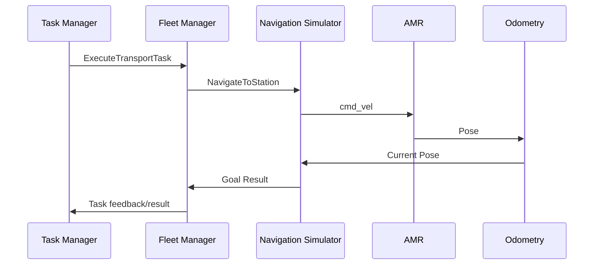

Fleet Manager quyết định:

```text
WHERE TO GO
```

Navigation simulator quyết định:

```text
HOW TO GET THERE
```

For M3, Task Manager owns queue/retry/lifecycle while Fleet Manager owns the
robot registry, eligibility selection and pickup/delivery execution. Nav2 and
advanced path planning remain outside the MVP.

---

# 29. Simulation Architecture

Simulation Engine không dùng Gazebo để chạy factory-scale what-if.

Dùng:

```text
SimPy
```

Luồng:

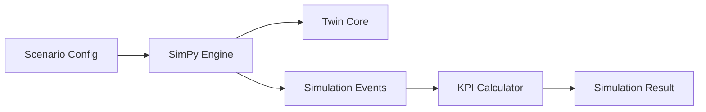

---

# 30. Simulation Event Model

Các event cơ bản:

```text
BATTERY_REQUESTED
TASK_CREATED
TASK_ASSIGNED
ROBOT_DEPARTED
ROBOT_ARRIVED_BUFFER
BATTERY_PICKED
ROBOT_ARRIVED_MARRIAGE
BATTERY_DELIVERED
TASK_COMPLETED

ROBOT_WAIT_STARTED
ROBOT_WAIT_ENDED

ROBOT_CHARGE_STARTED
ROBOT_CHARGE_COMPLETED

STARVATION_STARTED
STARVATION_ENDED

CONGESTION_STARTED
CONGESTION_ENDED
```

---

# 31. Simulation Scenario

Ví dụ:

```yaml
name: baseline

duration_minutes: 480

production:
  takt_time_seconds: 60

fleet:
  robot_count: 5
  speed_mps: 1.2
  battery_threshold_percent: 20

factory:
  charging_station_count: 1

battery_logistics:
  buffer_to_marriage_distance_m: 80
```

---

# 32. Simulation Output

```json
{
  "scenario_id": "baseline",
  "completed_tasks": 461,
  "throughput_per_hour": 57.6,
  "avg_cycle_time_seconds": 72.4,
  "starvation_events": 4,
  "starvation_seconds": 153,
  "avg_robot_utilization": 0.78,
  "avg_robot_waiting_percent": 11.2,
  "congestion_events": 8,
  "travel_distance_km": 21.4
}
```

---

# 33. KPI Definitions

## Throughput

```text
completed deliveries / simulation duration
```

---

## Cycle Time

```text
task completed time
-
task created time
```

---

## Starvation

Condition:

```text
Marriage Station ready
AND
required battery not available
```

Metrics:

```text
starvation event count
total starvation duration
```

---

## Robot Utilization

```text
productive robot time
/
available robot time
```

---

## Robot Waiting

```text
waiting duration
/
available robot time
```

---

## Congestion

MVP definition:

```text
zone robot count >= configured threshold
```

hoặc:

```text
robot waiting in traffic > configured duration
```

---

## Delivery Delay

```text
actual arrival time
-
required arrival time
```

---

# 34. Scenario Lifecycle

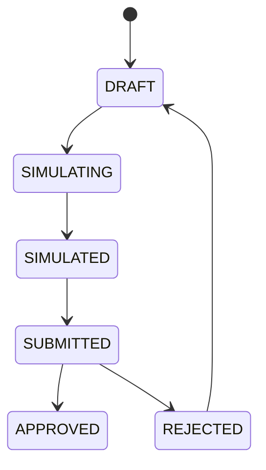

---

# 35. Scenario Comparison

Comparison service nhận:

```text
Scenario A result
Scenario B result
```

và trả:

```json
{
  "throughput_delta_pct": 18.7,
  "cycle_time_delta_pct": -16.7,
  "starvation_delta_pct": -83.0,
  "waiting_delta_pct": -61.0,
  "congestion_delta_pct": -71.0
}
```

UI:

```text
                    BASELINE     PROPOSED

Throughput            91           108
Cycle Time           74.2          61.8
Starvation             6             1
Waiting               18%            7%
Congestion             14             4
```

---

# 36. Congestion Heatmap

Factory chia thành logical zones.

Mỗi zone lưu:

```text
zone_id
robot_count
waiting_time
event_count
occupancy
```

Heat score có thể bắt đầu đơn giản:

```text
score =
normalized occupancy
+
normalized waiting
```

Frontend render:

```text
LOW      → green-like intensity
MEDIUM
HIGH
```

Không hard-code business color trong domain logic.

---

# 37. Frontend Architecture

```text
apps/frontend/src/
│
├── app/
│
├── components/
│   ├── ui/
│   └── common/
│
├── features/
│   ├── factory/
│   ├── fleet/
│   ├── robots/
│   ├── tasks/
│   ├── scenarios/
│   ├── simulation/
│   ├── replay/
│   └── approvals/
│
├── stores/
│   ├── factory-store.ts
│   ├── robot-store.ts
│   └── telemetry-store.ts
│
├── lib/
│   ├── api.ts
│   ├── websocket.ts
│   └── coordinates.ts
│
└── types/
```

---

# 38. Frontend State

Zustand runtime state:

```text
robots
tasks
stations
alerts
connection
currentScenario
simulationStatus
```

Telemetry update:

```text
WebSocket
 ↓
parse
 ↓
validate
 ↓
store update
 ↓
React render
```

Không request REST mỗi 100 ms.

REST dùng cho:

```text
initial state
CRUD
history
scenario
simulation
```

WebSocket dùng cho:

```text
realtime changes
```

---

# 39. Factory 3D Scene

Scene:

```text
FactoryScene
├── Floor
├── Stations
├── Racks
├── Chargers
├── Zones
├── RobotFleet
├── Routes
└── Labels
```

Robot:

```text
RobotMesh
├── position
├── rotation
├── status
├── task
└── payload
```

Không fetch network bên trong từng `RobotMesh`.

Tất cả robot lấy dữ liệu từ central store.

---

# 40. Main Frontend Pages

## Dashboard

```text
/
```

Chứa:

- Factory Twin.
- KPI summary.
- Fleet status.
- Alerts.

---

## Fleet

```text
/fleet
```

- Robot list.
- Status.
- Battery.
- Task.
- Utilization.

---

## Robot Detail

```text
/fleet/{robotId}
```

- Current state.
- Telemetry.
- Current task.
- History.

---

## Scenarios

```text
/scenarios
```

- Scenario list.
- Create.
- Clone.
- Edit.
- Run.

---

## Scenario Comparison

```text
/scenarios/compare
```

- KPI comparison.
- Chart.
- Improvement/deterioration.

---

## Replay

```text
/replay
```

- Timeline.
- Start.
- Pause.
- Seek.
- Speed.

---

## Approval

```text
/approvals
```

- Submitted scenarios.
- Metrics.
- Approve.
- Reject.

---

# 41. Database Architecture (target CORE schema)

Target CORE tables (not all are implemented yet):

```text
robots
battery_packs
stations
tasks
layouts
layout_objects
scenarios
simulation_runs
simulation_metrics
approvals
alerts
robot_telemetry
```

---

# 42. Database Relationship

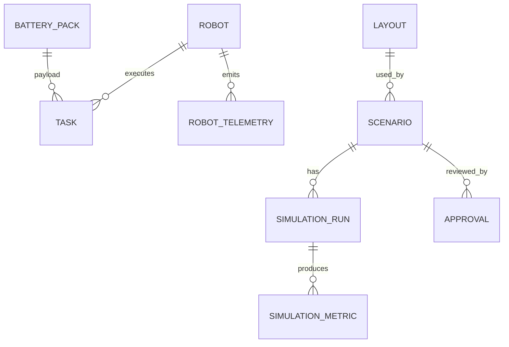

---

# 43. Telemetry Storage

`robot_telemetry_history` lưu normalized ROS samples. Sample đến trễ được giữ với
`ordering_status=LATE` nhưng không thay runtime snapshot; xem `docs/data-retention.md`.

Columns:

```text
robot_id
source_timestamp
ingested_at
pose
velocity
battery
status
task_id
payload_id
ordering_status
```

Index chính:

```text
(robot_id, source_timestamp)
```

Supabase PostgreSQL 17 dùng native daily range partitions do `pg_partman 5.3.1`
quản lý. `pg_cron` chạy maintenance mỗi giờ; partition telemetry chỉ giữ 30 ngày.

---

# 44. Replay Architecture (planned CORE capability)

Replay không có format riêng hoàn toàn khác Live Mode.

Luồng:

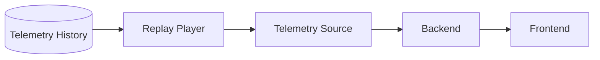

Frontend nhận telemetry giống Live Mode.

Điểm khác:

```text
source = REPLAY
```

---

# 45. Replay Controls

```text
PLAY
PAUSE
STOP

0.5x
1x
2x
4x

SEEK
```

Replay state:

```text
current_time
start_time
end_time
speed
status
```

---

# 46. Approval Architecture

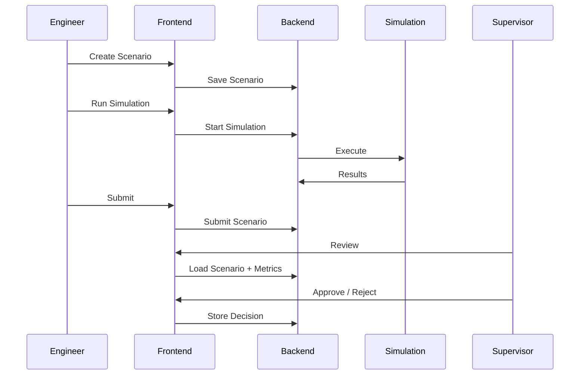

---

# 47. Approval Model

```text
Approval
├── id
├── scenario_id
├── reviewer
├── decision
├── comment
└── timestamp
```

Decision:

```text
APPROVED
REJECTED
```

Core không tự động deploy scenario xuống robot sau approval.

---

# 48. Alert Model

Core alert types:

```text
LOW_BATTERY
ROBOT_ERROR
ROBOT_OFFLINE
TASK_DELAY
BATTERY_DELIVERY_DELAY
CONGESTION
LINE_STARVATION
```

Alert:

```text
Alert
├── id
├── type
├── severity
├── entity_id
├── message
├── created_at
└── resolved_at
```

Severity:

```text
INFO
WARNING
HIGH
CRITICAL
```

---

# 49. Core Data Flow Summary

```text
                     ┌───────────────┐
                     │   GAZEBO      │
                     └───────┬───────┘
                             │
                             ▼
                         ┌───────┐
                         │ ROS 2 │
                         └───┬───┘
                             │
                             ▼
                   ┌─────────────────┐
                   │ Telemetry Bridge│
                   └────────┬────────┘
                            │
                            ▼
              ┌─────────────────────────┐
              │        FastAPI          │
              │                         │
              │ REST          WebSocket │
              └──────┬────────────┬─────┘
                     │            │
                     ▼            ▼
                PostgreSQL     Next.js
                     │            │
                     │            ▼
                     │         Zustand
                     │            │
                     │      ┌─────┴─────┐
                     │      ▼           ▼
                     │   Three.js     ECharts
                     │
                     ▼
                 Historical
                  Telemetry


        Scenario Configuration
                 │
                 ▼
              SimPy
                 │
                 ▼
             Twin Core
                 │
                 ▼
              Metrics
                 │
                 ▼
             FastAPI
                 │
                 ▼
               Web
```

---

# 50. Development Environment

Common target environment:

```text
Ubuntu 24.04
Python 3.12
Node.js 22
ROS 2 Jazzy
Gazebo Harmonic
```

Arch Linux:

```text
Arch
└── Distrobox Ubuntu 24.04
```

Windows:

```text
Windows
└── WSL2 Ubuntu 24.04
```

ROS scripts không được hard-code developer-specific path.

---

# 51. Dependency Management

Python application:

```text
pyproject.toml
uv.lock
uv
```

ROS:

```text
package.xml
rosdep
colcon
```

Không đưa:

```text
ros2_ws
```

vào uv workspace.

---

# 52. Testing Architecture

```text
                E2E
                 ▲
                 │
          Integration Tests
                 ▲
         ┌───────┼────────┐
         │       │        │
      Backend   ROS    Frontend
         ▲       ▲        ▲
         │       │        │
       Unit    Unit     Component
```

---

# 53. Python Quality

```text
Ruff
Mypy
Pytest
pytest-cov
```

Local:

```bash
make check
```

CI phải chạy cùng command.

---

# 54. Frontend Quality

```text
ESLint
TypeScript
Vitest
Testing Library
Playwright
```

---

# 55. ROS Quality

```text
rosdep
colcon build
colcon test
```

ROS CI chỉ chạy khi:

```text
ros2_ws/**
```

thay đổi.

---

# 56. Critical Integration Tests

## Telemetry Integration

```text
Mock
 ↓
FastAPI
 ↓
WebSocket
 ↓
Client
```

Expected:

Telemetry gửi vào backend phải xuất hiện đúng ở WebSocket subscriber.

---

## Scenario Integration

```text
Scenario
 ↓
Simulation
 ↓
Metrics
 ↓
Database
 ↓
API
```

---

## Replay Integration

```text
Historical Telemetry
 ↓
Replay
 ↓
WebSocket
 ↓
Frontend
```

---

# 57. Deployment Architecture

Hackathon / Development (planned; no Compose files are currently committed):

```text
Laptop
├── ROS2
├── Gazebo
└── Telemetry Bridge

Optional Docker Compose checkpoint
├── Backend
├── Frontend
└── PostgreSQL
```

Production:

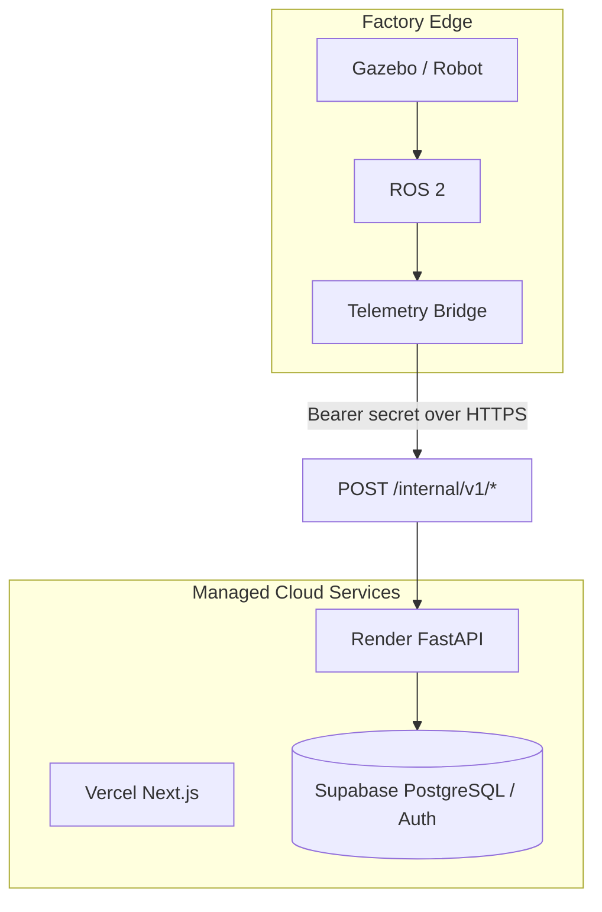

---

# 58. CI/CD Structure

```text
.github/workflows/ci.yml
```

## `ci.yml`

```text
Python Quality
Frontend Quality
```

## ROS CI workflow (planned with the first real ROS package)

```text
rosdep
colcon build
colcon test
```

## Docker CI workflow (planned with the first real image)

```text
build backend
build frontend
push GHCR
```

## Deployment workflow (planned after container smoke tests)

```text
deploy application stack
```

ROS, Docker, and deployment workflows are added only when their corresponding
buildable artifacts exist. Empty workflow files are not kept as placeholders.

---

# 59. Core Milestones

## M0 — Foundation

```text
uv workspace
Ruff
Mypy
Pytest
Makefile
Git workflow
GitHub Actions
```

---

## M1 — Vertical Slice

```text
Mock
  ↓
FastAPI
  ↓
WebSocket
  ↓
Next.js
  ↓
Robot moves
```

Song song:

```text
Gazebo
 ↓
ROS
 ↓
/odom
```

Acceptance:

- Một AMR.
- Telemetry ≥10 Hz.
- Browser update realtime.
- Mock/ROS dùng cùng schema.
- CI green.

---

## M2 — Robotics Integration

```text
Gazebo
 ↓
ROS
 ↓
Telemetry Bridge
 ↓
FastAPI
 ↓
WebSocket
 ↓
Three.js
```

Acceptance:

- Robot trong browser phản ánh Gazebo.
- Không sửa frontend khi chuyển Mock → ROS.

---

## M3 — Battery Logistics

```text
Battery Buffer
 ↓
AMR
 ↓
Marriage Station
```

Acceptance:

- Battery có ID.
- Task có lifecycle.
- Robot carrying state.
- Pickup/delivery visible.

---

## M4 — Fleet

Acceptance:

- Nhiều AMR.
- Task assignment.
- Battery level.
- Charging.
- Waiting.
- Robot details.

---

## M5 — Factory KPI

Acceptance:

- Throughput.
- Cycle time.
- Starvation.
- Utilization.
- Waiting.
- Congestion.
- Travel distance.

---

## M6 — Simulation

Acceptance:

- SimPy baseline scenario.
- Configurable fleet.
- Configurable production.
- KPI output.
- Reproducible results.

---

## M7 — Scenario Decision Support

Acceptance:

- Create scenario.
- Clone.
- Simulate.
- Compare A/B.
- Save results.

---

## M8 — Congestion & Layout

Acceptance:

- Traffic zones.
- Congestion events.
- Heatmap.
- Layout/config revisions.

---

## M9 — Replay

Acceptance:

- Historical telemetry.
- Timeline.
- Replay speed.
- Same frontend twin.

---

## M10 — Approval

Acceptance:

```text
DRAFT
→ SIMULATED
→ SUBMITTED
→ APPROVED / REJECTED
```

Audit information lưu được.

---

# 60. Core Definition of Done

Core được coi là hoàn thành khi tất cả flow dưới đây hoạt động.

## Live Flow

```text
Gazebo
 ↓
ROS
 ↓
Telemetry Bridge
 ↓
Backend
 ↓
WebSocket
 ↓
3D Digital Twin
```

---

## Logistics Flow

```text
Battery Request
 ↓
Task
 ↓
AMR Assignment
 ↓
Pickup
 ↓
Transport
 ↓
Delivery
 ↓
Marriage
```

---

## Planning Flow

```text
Scenario
 ↓
SimPy
 ↓
Metrics
 ↓
Compare
```

---

## Decision Flow

```text
Engineer
 ↓
Create
 ↓
Simulate
 ↓
Compare
 ↓
Submit
 ↓
Supervisor
 ↓
Approve / Reject
```

---

## Analysis Flow

```text
Telemetry History
 ↓
Replay
 ↓
Congestion / KPI
 ↓
Incident Analysis
```

---

# 61. Core Architectural Rules

Các rule sau không được vi phạm.

### Rule 1

Frontend không giao tiếp trực tiếp ROS.

---

### Rule 2

ROS packages không nằm trong uv workspace.

---

### Rule 3

Telemetry phải dùng một contract thống nhất.

---

### Rule 4

Mock, ROS và Replay phải interchangeable.

---

### Rule 5

Business logic dùng chung phải nằm trong `twin-core`.

---

### Rule 6

SimPy và Gazebo phục vụ hai mục đích khác nhau.

```text
Gazebo → robotics validation

SimPy → factory decision simulation
```

---

### Rule 7

Frontend không tự tính business KPI quan trọng.

KPI được định nghĩa ở backend/core/evaluation.

---

### Rule 8

REST cho CRUD/query.

WebSocket cho realtime.

---

### Rule 9

Không hard-code developer machine paths.

---

### Rule 10

Không merge nếu:

```text
lint fails
typecheck fails
tests fail
CI fails
```

---

# 62. Final Core Architecture

```text
                           USER

                    ┌───────────────┐
                    │    Next.js    │
                    │               │
                    │ Dashboard     │
                    │ Factory Twin  │
                    │ Fleet         │
                    │ Scenario      │
                    │ Replay        │
                    │ Approval      │
                    └───────┬───────┘
                            │
                    REST + WebSocket
                            │
                            ▼
                    ┌───────────────┐
                    │    FastAPI    │
                    └───────┬───────┘
                            │
              ┌─────────────┼─────────────┐
              │             │             │
              ▼             ▼             ▼
         ┌─────────┐   ┌─────────┐   ┌──────────┐
         │Twin Core│   │Database │   │ SimPy    │
         │         │   │         │   │Simulation│
         └────▲────┘   └─────────┘   └────▲─────┘
              │                            │
              └─────────────┬──────────────┘
                            │
                     common domain
                            │
                            ▼
                   ┌────────────────┐
                   │Telemetry Source│
                   └───────▲────────┘
                           │
              ┌────────────┼─────────────┐
              │            │             │
            MOCK         REPLAY          ROS
                                         │
                                         ▼
                                ┌────────────────┐
                                │Telemetry Bridge│
                                └───────▲────────┘
                                        │
                                       ROS2
                                        │
                                       Nav2
                                        │
                                      Gazebo
                                        │
                                       AMR
```

---

# 63. Architecture Vision

Core platform không được thiết kế như:

```text
"một dashboard hiển thị robot"
```

mà phải là:

```text
              DIGITAL TWIN CORE

                     │
      ┌──────────────┼──────────────┐
      │              │              │
 LIVE STATE      SIMULATION       HISTORY
      │              │              │
      └──────────────┼──────────────┘
                     │
                     ▼
                 FACTORY KPI
                     │
                     ▼
               HUMAN DECISION
```

Core phải trả lời được ba câu hỏi:

### What is happening?

```text
Live Digital Twin
```

### What would happen?

```text
Simulation
```

### What happened?

```text
History + Replay
```

Và cuối cùng hỗ trợ:

### What should we choose?

```text
Scenario Comparison
+
Human Approval
```

Đây là boundary chính thức của **EV Factory Digital Twin Core v0.1**.

## MVP Advanced Boundary

Đối với checkpoint bám sát `TOPIC.md`, runtime acceptance path là:

```text
Gazebo nhiều AMR
  ↕ ROS 2 topics/services
Fleet/Task Manager
  ↕
Telemetry Bridge → FastAPI → WebSocket → Next.js/Three.js
                                      ↑
Layout → SimPy → KPI → Compare → Approve → Apply
```

ROS 2/Gazebo chạy tại factory edge hoặc robotics VM/container host. Browser chỉ
gọi FastAPI; không expose ROS DDS, Gazebo hoặc ROS graph ra Internet.

MVP bắt buộc có layout làm input chung cho SimPy và route/configuration của Gazebo,
ít nhất hai AMR, command/task path hai chiều, cảnh báo bất thường và benchmark
latency/FPS cơ bản. Mock factory chỉ dùng cho test/local fallback.

Incident replay UI đầy đủ, retention dài hạn ngoài policy, battery genealogy,
AI/ML và MES/ERP nằm ngoài boundary MVP. Telemetry history cần thiết, bounded
deterministic flow optimization và partition/retention policy thuộc MVP.

Layout persistence separates mutable identity metadata in `layouts` from
append-only JSON geometry/config snapshots in `layout_versions`. FastAPI validates
the typed `twin-core` contract before PostgreSQL insert. Browser writes never go
directly through Supabase Data API; authenticated clients read/write through
FastAPI and database RLS remains defense in depth.

Every persisted SimPy candidate references an immutable `(layout_id, version)`.
The simulation derives route distance and congestion from that geometry, models
individual robot battery/charging and publishes the nine authoritative KPI from
`twin-core`. Flow optimization is a deterministic Cartesian search capped at 64
candidates; each evaluated candidate remains auditable through the scenario row.
Backend `ScenarioService` requires `LayoutService`; there is no layout-free or
legacy benchmark fallback in the API runtime. The legacy simulation runner is
kept only for standalone evaluation fixtures.

Scenario application uses a durable outbound-only command path. Render stores a
PENDING command; the edge bridge leases it over authenticated HTTPS, records ACK,
executes the typed `/fleet/apply_scenario` ROS service and posts the terminal
result. One operation has multiple immutable attempts. A scenario remains
APPROVED through PENDING/ACKNOWLEDGED/FAILED/TIMED_OUT and becomes APPLIED only
after a positive result. Unsupported topology changes fail explicitly and require
a Gazebo relaunch.
