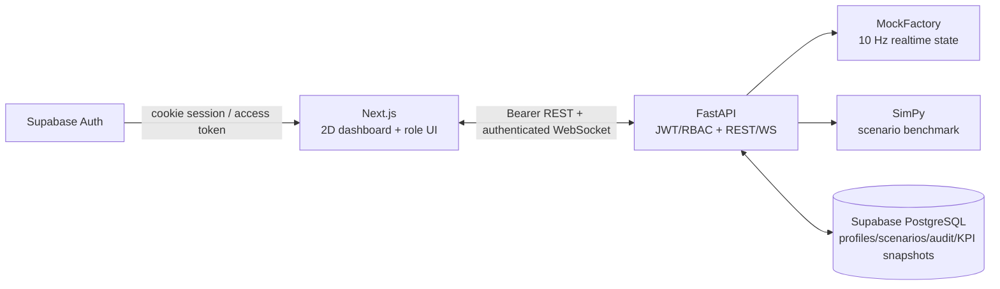
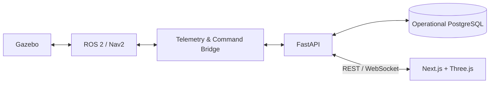

# System Architecture

## Current MVP architecture

Robot/task/alert/metrics đang chạy nằm trong RAM và reset khi backend restart.
Profile, scenario workflow, audit log và KPI snapshot 10 giây được lưu PostgreSQL
khi `DATABASE_URL` được cấu hình. Raw robot telemetry 10 Hz không được lưu trong MVP.

## Target architecture

Gazebo, ROS2, telemetry bridge và Three.js thuộc kiến trúc mục tiêu, chưa phải
thành phần đã hoàn thành của MVP hiện tại.

## Runtime Boundaries
- Edge
- ROS 2
- Gazebo
- Nav2
- Fleet Manager
- Telemetry Bridge
- Application / Cloud
- FastAPI
- PostgreSQL / TimescaleDB
- Simulation Engine
- Next.js
- Three.js

Đây là architecture **v1**. Mỗi quyết định lớn tiếp theo phải cập nhật ADR.
