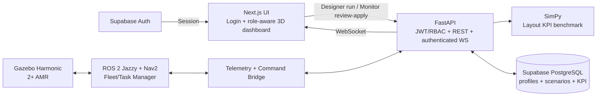
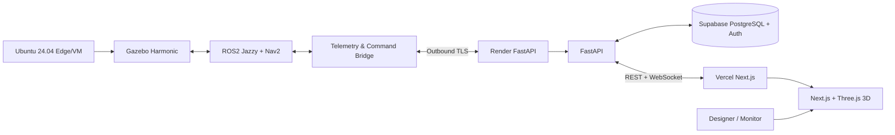

# Pitch Deck & Demo Materials

## Files

- `pitch_deck.pptx` — Slide thuyết trình Demo Day
- `video_demo.mp4` — Video demo sản phẩm (tối đa 5 phút)

## Pitch Deck Structure (10 slides)

1. **Title** — Tên dự án + Team
2. **Problem** — Vấn đề là gì? Có bao nhiêu người gặp?
3. **Solution** — Giải pháp AI của bạn
4. **Demo** — Screenshot/Video ngắn
5. **Architecture** — System diagram đơn giản
6. **Tech Stack** — Technologies used
7. **Traction** — Metrics, users, feedback
8. **Market** — Quy mô thị trường
9. **Team** — Ai làm gì
10. **Ask** — Bạn cần gì tiếp theo?

## Video Demo Checklist

- [ ] Giới thiệu problem (< 30 giây)
- [ ] Demo live feature chính (2-3 phút)
- [ ] Hiển thị kết quả benchmark và bước phê duyệt (1 phút)
- [ ] Tóm tắt impact (< 30 giây)

## Slide kiến trúc hiện tại — MVP nâng cao

Thông điệp trình bày:

- Gazebo/ROS2 là nguồn realtime chính; MockFactory chỉ là fallback test/local.
- SimPy phục vụ so sánh nhanh baseline/candidate.
- Server chặn sai role và chặn Apply nếu scenario chưa được Approve.
- Scenario/actor/KPI lưu PostgreSQL; raw telemetry replay không thuộc MVP.
- Factory view chính là 3D và browser không truy cập trực tiếp ROS DDS.

## Slide kiến trúc deployment

ROS2/Gazebo không chạy trên Vercel hoặc Render. Edge chỉ mở outbound TLS và không
expose ROS DDS ra Internet. `pg_partman` chưa cần cho MVP vì chưa lưu raw telemetry
dài hạn.

## Luồng demo 5 phút

1. Overview: trạng thái `LIVE`, robot di chuyển và KPI realtime.
2. Robot detail: pose, pin, task và payload.
3. Scenario: chạy candidate và so sánh với baseline.
4. Chứng minh Designer không có quyền Approve/Apply và Monitor không có quyền Run.
5. Monitor bấm Apply trước Approve để giải thích server-side state guard.
6. Monitor Approve rồi Apply; quay lại Factory và quan sát số robot/config đã reset.
7. Kết thúc bằng latency/FPS benchmark và sơ đồ edge deployment.
