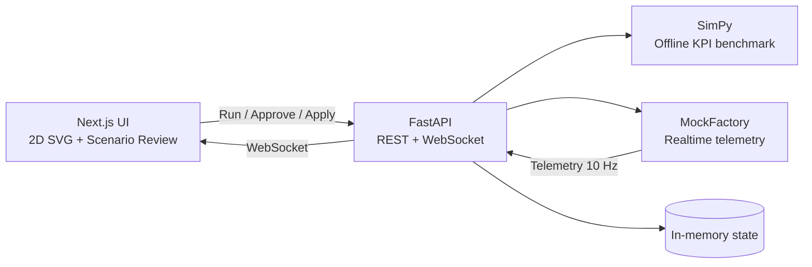
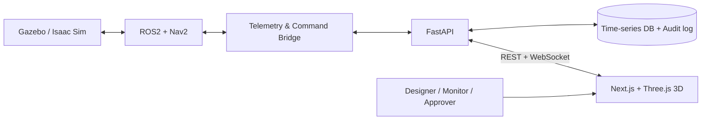

# Pitch Deck & Demo Materials

## Files

- `pitch_deck.pptx` — Slide thuyết trình Demo Day
- `video_demo.mp4` — Video demo sản phẩm (tối đa 5 phút)

## Pitch Deck Structure (10 slides)

1. **Title** — Tên dự án + Team
2. **Problem** — Vấn đề là gì? Có bao nhiêu người gặp?
3. **Solution** — Giải pháp AI của bạn
4. **Demo** — Screenshot/Video ngắn
5. **Architecture** — System diagram đơn giản
6. **Tech Stack** — Technologies used
7. **Traction** — Metrics, users, feedback
8. **Market** — Quy mô thị trường
9. **Team** — Ai làm gì
10. **Ask** — Bạn cần gì tiếp theo?

## Video Demo Checklist

- [ ] Giới thiệu problem (< 30 giây)
- [ ] Demo live feature chính (2-3 phút)
- [ ] Hiển thị kết quả benchmark và bước phê duyệt (1 phút)
- [ ] Tóm tắt impact (< 30 giây)

## Slide kiến trúc hiện tại — MVP

Thông điệp trình bày:

- MockFactory phục vụ monitoring realtime.
- SimPy phục vụ so sánh nhanh baseline/candidate.
- Server chặn Apply nếu scenario chưa được Approve.
- Factory view hiện là 2D; state và scenario chưa lưu bền vững.

## Slide kiến trúc mục tiêu — sau MVP

Không trình bày kiến trúc mục tiêu như phần đã hoàn thành. Nêu rõ bước tiếp theo là
thay nguồn telemetry MockFactory bằng ROS2 bridge mà không đổi contract frontend.

## Luồng demo 5 phút

1. Overview: trạng thái `LIVE`, robot di chuyển và KPI realtime.
2. Robot detail: pose, pin, task và payload.
3. Scenario: chạy candidate và so sánh với baseline.
4. Bấm Apply trước Approve để giải thích server-side guard.
5. Approve rồi Apply; quay lại Factory và quan sát số robot/config đã reset.
6. Kết thúc bằng ranh giới MVP và roadmap 3D/ROS2/Gazebo.
