# Manual Evaluation Evidence — EV Factory Digital Twin

## Evaluation record

| Field | Value |
|---|---|
| Evaluation date | 2026-08-17 |
| Environment | Local MVP (`localhost:3000`), API data source |
| Evidence source | `D:\video\demo_T078.mp4` |
| Source duration | 192.667 seconds (30 FPS, 1854 × 906) |
| Source SHA-256 | `f93e80c38818767a5d875b63f38c1a0616a49de0ed92a04d3ab0f85ba5b75adb` |
| Roles observed | Demo Designer, Demo Monitor |
| Evaluation method | Manual review of the recorded end-to-end browser session |

The screenshots in `evaluation/evidence/` are lossless frames extracted from the
source recording at the timestamps stated below. Actual outputs are transcribed
only from visible UI state; no missing API response or authorization result is
inferred.

## Summary

| ID | Manual test case | Result | Evidence timestamp |
|---|---|---|---|
| EV-01 | Realtime overview and robot inspection | PASS | 00:00.0 |
| EV-02 | Realtime 2D factory map and active alerts | PASS | 00:52.0 |
| EV-03 | Fleet state visibility | PASS | 01:01.0 |
| EV-04 | Live analytics visibility | PASS | 01:12.0 |
| EV-05 | Designer runs and compares a candidate scenario | PASS | 01:31.0 |
| EV-06 | Monitor reviews, approves, and applies a scenario | PASS | 02:04–02:16 |
| EV-07 | Applied configuration propagates and remains visible | PASS | 02:26–03:11.5 |

**Total: 7 manual test cases — 7 PASS, 0 FAIL.**

---

## EV-01 — Realtime overview and robot inspection

**Role:** Designer  
**Precondition:** The user is authenticated and factory telemetry is connected.

### Steps

1. Open the Overview page.
2. Confirm the connection indicator and KPI cards.
3. Select `AMR-03` on the factory twin.
4. Inspect the robot details drawer.

### Expected output

- The page shows a `LIVE` connection state and current factory KPIs.
- Selecting a robot exposes its status, battery, speed, position, task, payload,
  and last-seen time.

### Actual output

- Connection state: `LIVE`.
- Throughput: `385.5 tasks/h`.
- Fleet online: `5/5`.
- Average cycle: `23.9 s`.
- Starvation: `0`.
- Selected robot: `AMR-03`, `MOVING TO PICKUP`.
- Battery: `25%`; speed: `1.2 m/s`.
- Position: `X 15.42 m`, `Y 7.84 m`; yaw: `-2.86 rad`.
- Current task: `TASK-0028`; payload: `None`.

### Result

**PASS** — the overview and selected robot state are visible together.

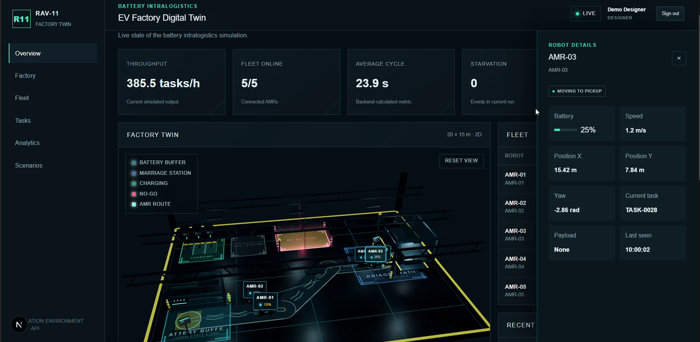

---

## EV-02 — Realtime 2D factory map and active alerts

**Role:** Designer  
**Precondition:** Factory telemetry and alert streams are active.

### Steps

1. Open the Factory page.
2. Observe the 2D factory zones and AMR markers.
3. Observe the Active Alerts window.

### Expected output

- The map renders the battery buffer, idle/staging area, no-go zone, marriage
  station, AMR route, and current robots.
- Active alerts appear beside the map without replacing it.

### Actual output

- The page displays the realtime 2D `BATTERY TRANSFER ZONE`.
- Multiple AMRs are visible at distinct route positions with battery values.
- The Active Alerts window contains `WARNING · LOW_BATTERY` and
  `INFO · ROBOT_WAITING` records.
- The top bar remains in `LIVE` state.

### Result

**PASS** — the 2D map and live alert feed are simultaneously visible.

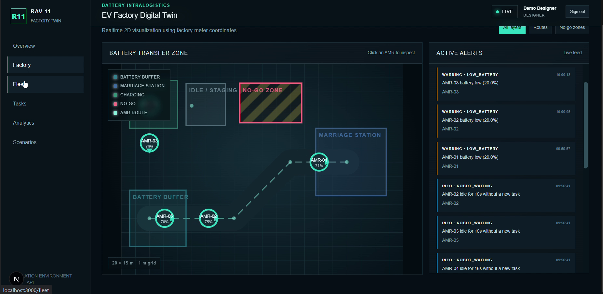

---

## EV-03 — Fleet state visibility

**Role:** Designer  
**Precondition:** Five AMRs are active in the mock factory.

### Steps

1. Open the Fleet page.
2. Select the `ALL` filter.
3. Inspect identity, status, battery, speed, task, payload, and last-seen data.

### Expected output

- All current robots appear in the fleet table.
- Operational fields are visible per robot.

### Actual output

- Five rows are visible: `AMR-01` through `AMR-05`.
- The table shows status, battery, speed, current task, payload, and last seen.
- Observed statuses include `MOVING TO PICKUP` and `DELIVERING`.
- Observed moving speed is `1.2 m/s`.

### Result

**PASS** — all five active robots and their operational fields are visible.

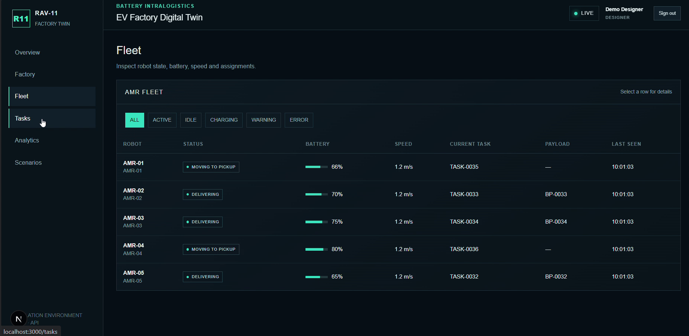

---

## EV-04 — Live analytics visibility

**Role:** Designer  
**Precondition:** WebSocket telemetry has populated KPI history.

### Steps

1. Open the Analytics page.
2. Inspect the KPI cards.
3. Inspect throughput and cycle-time trend charts.

### Expected output

- Current KPIs and recent time-series trends are rendered.
- Fleet and task counts agree with the running factory state.

### Actual output

- Throughput: `409.2 tasks/h`.
- Fleet online: `5/5`.
- Average cycle: `24.4 s`.
- Starvation: `0`.
- Active tasks: `3`.
- Both `THROUGHPUT TREND` and `CYCLE-TIME TREND` contain plotted data.

### Result

**PASS** — current metrics and recent KPI history are visible.

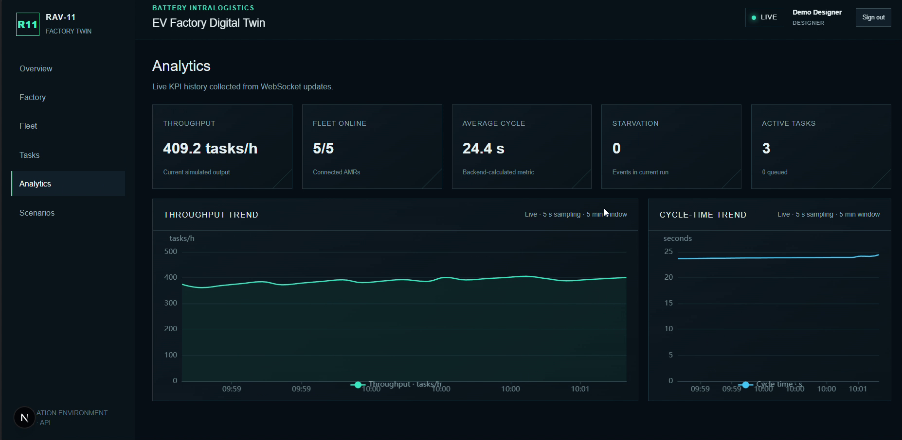

---

## EV-05 — Designer runs and compares a candidate scenario

**Role:** Designer  
**Precondition:** Baseline simulation data is available.

### Steps

1. Open Scenario Sandbox.
2. Configure `candidate-01` with 5 robots and 500 tasks.
3. Use arrival interval `5 s`, travel time `30 s`, loading time `10 s`, and
   simulation time `3600 s`.
4. Select **Run benchmark**.
5. Compare candidate metrics with the baseline.

### Expected output

- The scenario becomes `SIMULATED`.
- Baseline and candidate KPI values are presented with comparison labels.
- The Designer cannot approve or apply the scenario they created.

### Actual output

- Scenario: `candidate-01`; ID: `SCN-0005`; status: `SIMULATED`.
- Completed: `355`; benchmark time: `13.7 ms`.

| Metric | Baseline | Candidate | UI result |
|---|---:|---:|---|
| Throughput | 213 tasks/h | 355 tasks/h | BETTER |
| Average cycle time | 1,275 s | 925 s | BETTER |
| Average waiting time | 1,225 s | 875 s | BETTER |
| Completion rate | 42.6% | 71% | BETTER |
| Backlog | 287 tasks | 145 tasks | BETTER |

- The UI states: `Waiting for monitor review. Designers cannot approve or apply their own scenario.`
- No Approve or Apply action is presented to the Designer in this state.

### Result

**PASS** — the benchmark produces an actual comparison and enforces a separate
Monitor review step in the visible workflow.

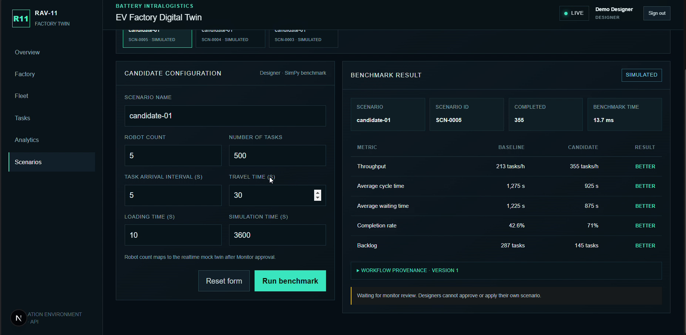

---

## EV-06 — Monitor reviews, approves, and applies a scenario

**Role:** Monitor  
**Precondition:** `candidate-01` / `SCN-0006` is in `SIMULATED` state.

### Steps

1. Sign in as Demo Monitor and select `SCN-0006`.
2. Verify the selected configuration is read-only.
3. Select **Approve**.
4. Select **Apply to factory** and confirm the browser prompt.
5. Observe the final workflow state.

### Expected output

- The Monitor sees the candidate in read-only mode.
- Approve transitions `SIMULATED → APPROVED`.
- Apply transitions `APPROVED → APPLIED`.
- Review actions are unavailable after application.

### Actual output

- Role shown: `Demo Monitor · MONITOR`.
- Configuration label: `MONITOR · Read only`.
- The simulated view presents `Reject` and `Approve` actions.
- After approval, the status is `APPROVED` and `Apply to factory` is available.
- The confirmation prompt states that the realtime mock factory will reset and
  current tasks will be cleared.
- Final state: `APPLIED`.
- Final UI message: `No review action is available for a applied scenario.`

### Result

**PASS** — all three recorded workflow states occur in the required order.

| SIMULATED | APPROVED | APPLIED |
|---|---|---|
| 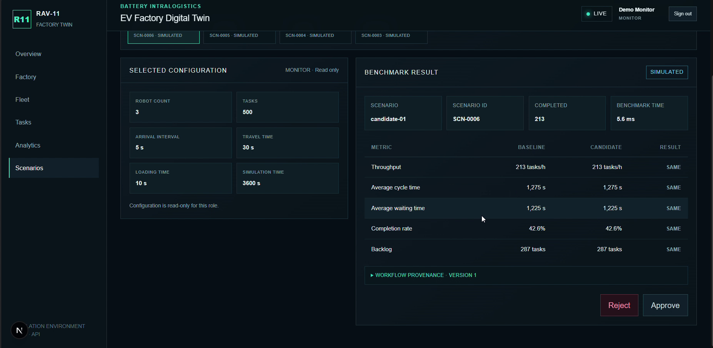 | 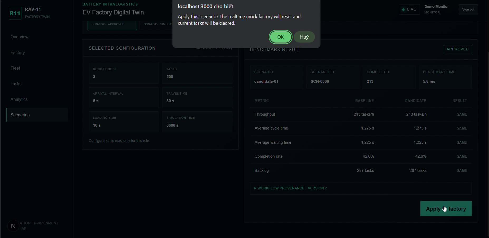 | 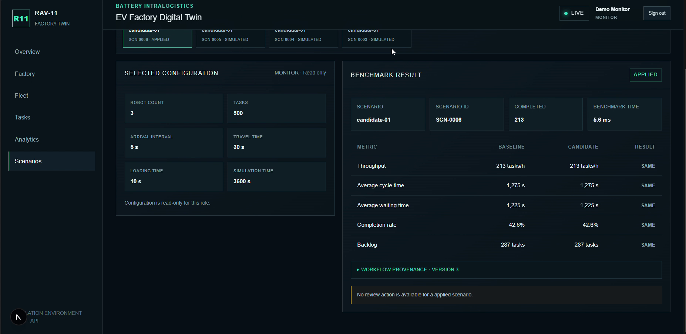 |

---

## EV-07 — Applied configuration propagates and remains visible

**Role:** Monitor  
**Precondition:** The 3-robot `SCN-0006` scenario has been applied.

### Steps

1. Return to Factory after Apply.
2. Observe the active AMR count and telemetry.
3. Open Analytics and verify the fleet count and new KPI history.
4. Return to Scenarios and reselect the applied scenario.

### Expected output

- Factory resets to the candidate robot count.
- Realtime monitoring resumes after reset.
- Analytics reflects the new fleet.
- Scenario history retains the `APPLIED` state.

### Actual output

- Factory shows three AMR markers after Apply.
- Analytics shows `3/3` fleet online, `224.5 tasks/h`, `21.0 s` average cycle,
  starvation `0`, and `3` active tasks.
- Throughput and cycle-time charts contain post-reset data.
- Scenario history still lists `SCN-0006 · APPLIED` at 03:11.5.
- The selected configuration remains read-only with robot count `3` and the
  benchmark result remains visible.

### Result

**PASS** — the applied robot count propagates to operational pages and the
workflow state remains visible later in the recorded session.

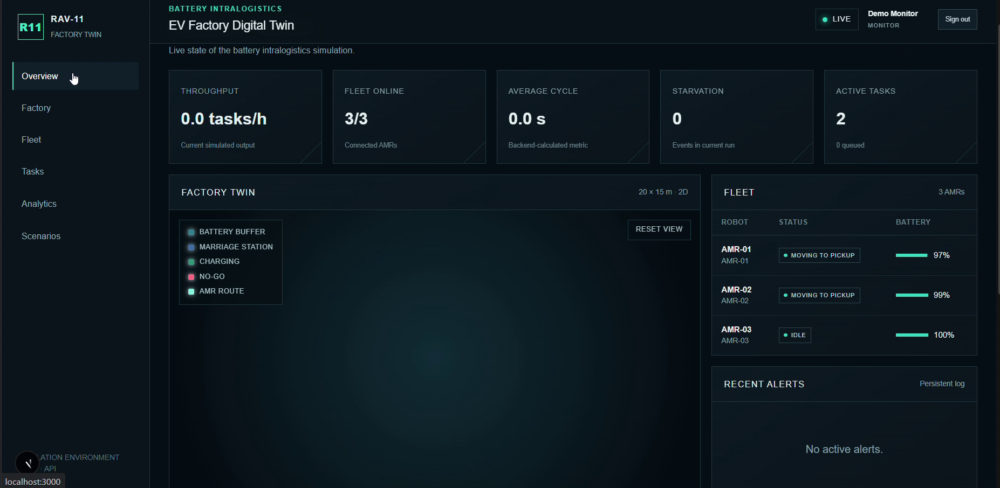

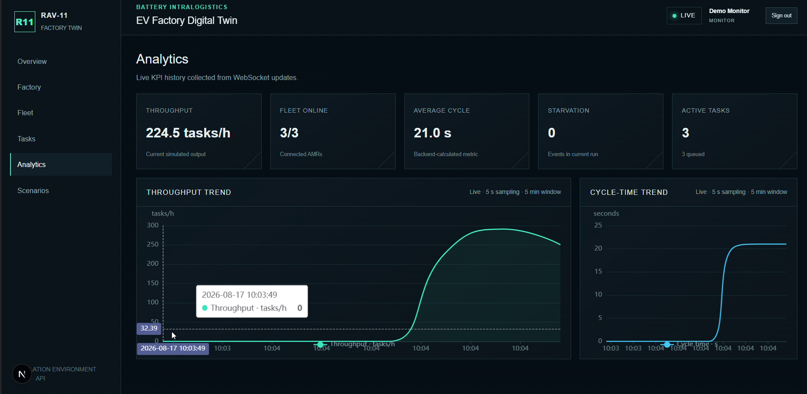

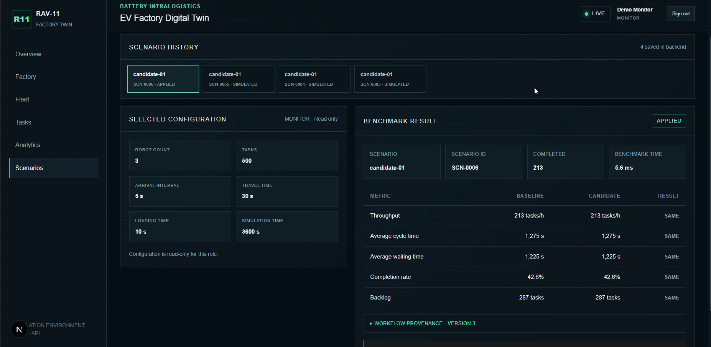

---

## Scope and remaining evidence gaps

This report proves seven successful manual UI flows using actual recorded output.
The source video does **not** show direct HTTP responses for the following
negative-path checks, so they are deliberately not claimed as evaluated here:

- Monitor Run request returns `403 Forbidden`.
- Designer Approve/Apply request returns `403 Forbidden`.
- Apply before Approve returns `409 Conflict`.
- Unauthenticated WebSocket receives no telemetry.
- Admin audit log contains the expected actor/action/timestamp record.

These checks are covered by the automated MVP flow and test suites where
applicable, but separate screenshots or saved command output are required before
adding them as manual evidence.
